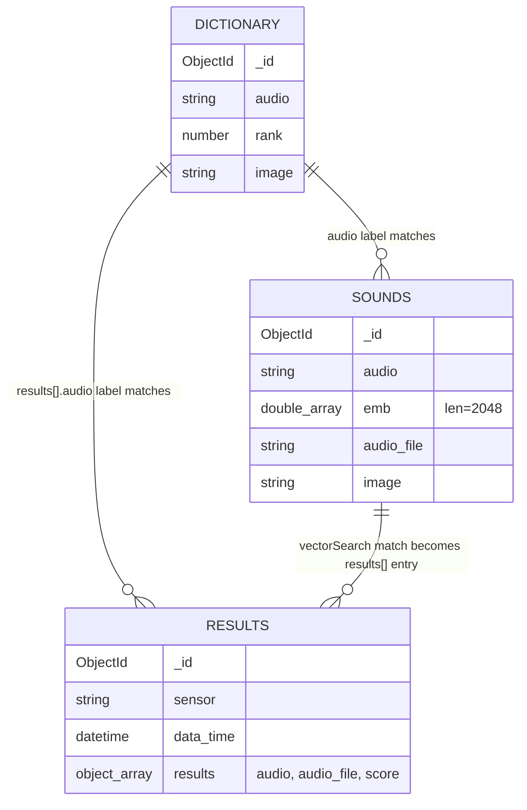

# EDD — Entity Document Diagram

Database `audio` on the MongoDB Atlas cluster referenced by `MONGODB_URI`. Both the
FastAPI backend (`api/main.py`) and the Next.js frontend (`frontend/src/lib/mongodb.js`,
`frontend/src/app/api/action/[action]/route.js`) connect to this same database and
database name (`DATABASE_NAME`, default `audio`).

Field types below were derived from the code that reads and writes documents
(`api/main.py`, `utils/indexes/create_vector_index.py`, and the frontend components under
`frontend/src/components/`) — this application defines no JSON Schema validators, so
there is no formal schema to compare against.

## Entity overview

| Collection | Written by | Read by | Vector index |
| --- | --- | --- | --- |
| `dictionary` | Not written by any code in this repo — populated manually in Atlas | Frontend (`page.js`, via `POST /api/action/find`) to render training categories | none |
| `sounds` | `api/main.py` (`insert_mongo_sounds`, during training) | `api/main.py` (`knnbeta_search`, during diagnostics); frontend (`audio.js`, `POST /api/action/deleteMany` to clear previous samples) | `vector_index` on `emb` |
| `results` | `api/main.py` (`insert_mongo_results`, after each diagnostic query) | Frontend (`DiagnosticsModule.js`) via a MongoDB change stream, relayed over Server-Sent Events at `GET /api/sse` | none |

## `dictionary`

Holds the training categories shown in the UI (e.g. normal running, stopped,
fault). Nothing in this repo inserts these documents — they are expected to exist in
the target database already; see *Known inconsistencies* below.

| Field | Type | Notes |
| --- | --- | --- |
| `_id` | ObjectId | Default Mongo id |
| `audio` | string | Category label, e.g. the name of the engine state. Matched against `sounds.audio` and `results.results[].audio` by value, not by reference |
| `rank` | number | Sort order; frontend queries with `sort: { rank: 1 }` |
| `image` | string | URL of the GIF shown in `DiagnosticsModule` when this category is detected |

No indexes beyond the default `_id` index.

## `sounds`

One document per recorded training sample. Written by `insert_mongo_sounds()` in
`api/main.py` while a user is on the "Start Recording" step; read back by
`knnbeta_search()` during diagnostics.

| Field | Type | Notes |
| --- | --- | --- |
| `_id` | ObjectId | Default Mongo id |
| `audio` | string | Category label the sample was recorded under (matches `dictionary.audio`) |
| `emb` | array\<double\> len=2048 | L2-normalized PANNs audio embedding produced by `get_embedding()`; this is the vector search field |
| `audio_file` | string | Always the literal `"0"` in the current code path (`insert_mongo_sounds(audio_name, emb.tolist(), "0", "", ...)`) — not a real file reference despite the name |
| `image` | string | Always `""` in the current code path; unused |

### Vector index `vector_index`

Defined in `utils/indexes/search_index.json` and created by
`utils/indexes/create_vector_index.py`:

```json
{
  "name": "vector_index",
  "type": "vectorSearch",
  "definition": {
    "fields": [
      {
        "path": "emb",
        "type": "vector",
        "numDimensions": 2048,
        "similarity": "cosine"
      }
    ]
  }
}
```

Queried via `$vectorSearch` in `knnbeta_search()` (`api/main.py`) with `numCandidates: 30`
and `limit: 3`, projecting `audio`, `audio_file`, and the match `score`. Must be created
once per Atlas cluster (Atlas only — `create_search_index` is not available against a
plain `mongod`); see the README's "MongoDB Atlas Configuration" section.

## `results`

One document per diagnostic query (i.e. per audio sample submitted without an
`audio_name`, meaning the request goes down the search path instead of the training
path). Written by `insert_mongo_results()` right after `knnbeta_search()` runs.

| Field | Type | Notes |
| --- | --- | --- |
| `_id` | ObjectId | Default Mongo id |
| `sensor` | string | Hardcoded to `"Ralph's laptop"` in `insert_mongo_results()` — not a real sensor identifier |
| `data_time` | datetime | Set with `datetime.now()` at insert time |
| `results` | array of `{ audio: string, audio_file: string, score: double }` | The top-3 `$vectorSearch` matches from `sounds`, in descending score order |

No indexes beyond the default `_id` index. The frontend never queries this collection
directly with `find`/`aggregate` — it watches it with `db.watch()` (see
`getChangeStream()` in `frontend/src/lib/mongodb.js`) and streams `change.fullDocument`
to the browser over SSE (`frontend/src/app/api/sse/route.js`), reading
`fullDocument.results[0].audio` to decide whether the detected state changed.

## Relationships

All relationships are **logical only** — no foreign keys, no `$lookup` in the current
code, no schema validators. Matching is done purely by comparing the `audio` string
field across collections.



## Known inconsistencies

1. **`sounds.audio_file` and `sounds.image` are dead fields.** `insert_mongo_sounds()` is
   always called with `audio_file="0"` and `image=""` (see the `else` branch of
   `POST /embed-audio` in `api/main.py`). The `$vectorSearch` `$project` in
   `knnbeta_search()` still returns `audio_file`, so every diagnostic result carries the
   literal string `"0"` under that key. If real audio-file storage or thumbnail images
   are added, update this row and the `results.results[].audio_file` row above.
2. **`dictionary` has no writer in this codebase.** Both `page.js` (initial load) and
   `DiagnosticsModule.js` (GIF lookup) assume `dictionary` documents already exist with
   `audio`, `rank`, and `image` fields, but no seed script, migration, or API route in
   this repo inserts them. Update this note if a seed script for `dictionary` is added.
3. **`results.sensor` is a hardcoded placeholder**, not a real sensor/device id
   (`"Ralph's laptop"` in `insert_mongo_results()`). Update this row if the field is ever
   populated from request data.
