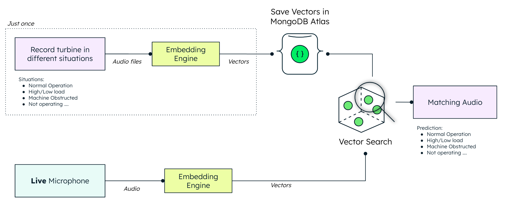

# Wind Turbine Diagnostics using MongoDB Vector Search

This demonstration showcases MongoDB's Vector Search capabilities for anomaly detection using sound input. We use a handheld fan as a proxy for a wind turbine, enabling real-time diagnostics of its condition—whether it's operating normally, stopped, or experiencing issues.



## Table of Contents

1. Prerequisites
2. Setup Options
   - Configuration
   - Option 1: Run with Docker Compose
   - Option 2: Run Without Docker
3. MongoDB Atlas Configuration
4. Atlas Charts
5. Troubleshooting

---

## Prerequisites

1. [Node.js (tested with v20.8.0)](https://nodejs.org/en/)

   - **Usage**: Node.js is used to run our frontend, which powers the user interface and interactions of the demo.
   - **Installation**:
     - **macOS**:
       - Install using Homebrew:
         ```bash
         brew install node
         ```

2. [Python 3.8+](https://www.python.org/downloads/)

   - **Usage**: Python is used for our backend. It handles tasks like audio processing, data processing, and interacting with MongoDB Atlas.
   - **Installation**:
     - **macOS**:
       - Install using Homebrew:
         ```bash
         brew install python
         ```

3. [A MongoDB Atlas Account](https://www.mongodb.com/cloud/atlas/register)

   - **Usage**: We are using MongoDB Atlas to store sound embeddings and other data, and to facilitate search capabilities via vector similarity.
   - **Setup**:
     - Create an account at [MongoDB Atlas](https://www.mongodb.com/cloud/atlas/register).
     - Once created, set up a cluster, and obtain the connection string which will be used in the `.env` file.

4. [FFmpeg](https://ffmpeg.org/download.html)

   - **Usage**: FFmpeg is used for audio processing, specifically to convert and manipulate audio files, which is a crucial part of diagnosing the wind turbine’s condition.
   - **Installation**:
     - **macOS**:
       - Install using Homebrew:
         ```bash
         brew install ffmpeg
         ```

5. [wget](https://www.gnu.org/software/wget/)

   - **Usage**: `wget` is used to download the model files that are essential for audio inference in this project.
   - **Installation**:
     - **macOS**:
       - Install using Homebrew:
         ```bash
         brew install wget
         ```

6. [Docker](https://www.docker.com/get-started)

   - **Usage**: Docker is used to containerize the application, enabling consistent and easy deployment of the entire stack.
   - **Installation**:
     - **macOS**:
       - Install using Homebrew:
         ```bash
         brew install --cask docker
         ```

---

## Setup Options

Choose one of the following two ways to set up and run the demo.

### Configuration

1. **Backend**: Create a `.env` file in the `api/` directory:

   ```
   MONGODB_URI="mongodb+srv://<your-atlas-connection-string>"
   ```

2. **Frontend**: Create a `.env.production` file in the `frontend/` directory (for Docker):
   ```
   MONGODB_URI="mongodb+srv://<your-atlas-connection-string>"
   ```
   > **Note**: For local development without Docker (`npm run dev`), also create a `.env` file in `frontend/` with the same content.

### Option 1: Run with Docker Compose

1. Clone the repository and navigate to the project folder.
2. Ensure you have created the configuration files as described above.
3. Start Docker Compose by running:
   ```bash
   docker-compose up --build
   ```
4. Access the frontend at `http://localhost:8080` in your browser.

### Option 2: Run Without Docker

#### Backend Setup (Port: 8000)

1. Navigate to the `api/` directory.
2. Create a virtual environment:
   ```bash
   python3 -m venv venv
   ```
3. Activate the virtual environment:
   ```bash
   source venv/bin/activate
   ```
4. Install dependencies:
   ```bash
   python3 -m pip install -r requirements.txt
   ```
5. Download the PANNs model checkpoint file and move it to the correct path (add your username in the path below):
   ```bash
   wget https://zenodo.org/record/3987831/files/Cnn14_mAP%3D0.431.pth?download=1 -O Cnn14_mAP=0.431.pth
   mv Cnn14_mAP=0.431.pth /Users/<your_username>/panns_data
   ```
6. Run the backend service:
   ```bash
   uvicorn main:app --reload --port 8000
   ```

#### Frontend Setup (Port: 8080)

1. Navigate to the `frontend/` directory.
2. Install dependencies:
   ```bash
   npm install
   ```
3. Start the frontend:
   ```bash
   npm run dev
   ```
4. Access the frontend at `http://localhost:8080`.

---

## MongoDB Atlas Configuration

First time accessing the project:

1. Choose your number of training samples and hit "Start Recording" on the frontend.

2. Once recording for all stages is complete, go to your MongoDB Atlas dashboard and create a search index in the `audio` database and `sounds` collection using the following content:

   ```json
   {
     "mappings": {
       "dynamic": true,
       "fields": {
         "emb": {
           "dimensions": 2048,
           "similarity": "cosine",
           "type": "knnVector"
         }
       }
     }
   }
   ```

3. You can now return to the frontend on your browser and click on "Start Diagnostics" to see the demo in action.

This step only needs to be done for the very first time that you’re connecting to your MongoDB Atlas cluster.

---

## Atlas Charts

1. In Atlas, go to Charts and click the down arrow next to "Add Dashboard", then click "Import Dashboard".
2. Select the file [Sounds.charts](utils/charts/Sounds.charts) and click "Next".
3. Click on the pencil icon and ensure the database and collection match `audio` and `results`.
4. Click "Save", and then "Save" again.
5. Click the new dashboard "Sounds" to see analytics on the sounds that are being detected by the microphone.

---

## Troubleshooting

- **Frontend Not Loading**:

  - Ensure that both the backend and MongoDB Atlas are running and accessible.
  - Check for any errors in the console.

- **Audio Device Issues**:

  - Use an external microphone if your device's microphone is not functioning properly.
  - Ensure that necessary libraries like wget and ffmpeg are installed.

- **Docker Errors**:

  - If containers fail, try rebuilding them by running:
    ```bash
    docker-compose down && docker-compose up --build
    ```
  - Ensure your `.env` files are properly set up in the `api/` and `frontend/` directories.

- **Database Connection Errors**:

  - Verify the `MONGODB_URI` in your `.env` files.
  - Ensure that your IP address is whitelisted in MongoDB Atlas.
  - Confirm that your MongoDB cluster is active and accessible.

---
